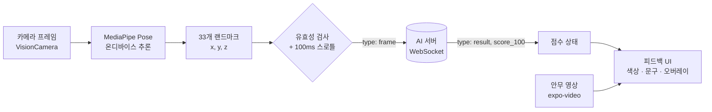

<div align="center">

# Groovo

**AI 실시간 자세 분석으로 K-pop 안무를 연습하는 모바일 앱**


[](https://reactnative.dev/)
[](https://expo.dev/)
[](https://reactnative.dev/)
[](https://www.typescriptlang.org/)

</div>

---

## 목차

- [프로젝트 소개](#프로젝트-소개)
- [주요 기능](#주요-기능)
- [아키텍처](#아키텍처)
- [기술 스택](#기술-스택)
- [시작하기](#시작하기)
- [환경 변수](#환경-변수)
- [안무 에셋 구성](#안무-에셋-구성)
- [실시간 채점 프로토콜](#실시간-채점-프로토콜)
- [프로젝트 구조](#프로젝트-구조)
- [스크립트](#스크립트)
- [권한](#권한)
- [트러블슈팅](#트러블슈팅)
- [브랜치 전략](#브랜치-전략)

---

## 프로젝트 소개

Groovo는 안무 영상을 따라 추는 사용자의 동작을 카메라로 촬영하고, 온디바이스 MediaPipe Pose Detection으로 추출한 33개 신체 랜드마크를 AI 서버로 스트리밍해 **실시간 자세 점수와 피드백**을 돌려받는 K-pop 댄스 연습 앱입니다.

기존 안무 연습이 "영상을 보고 혼자 따라 하기"에 머물렀다면, Groovo는 연습 중인 순간에 바로 "지금 자세가 맞는지"를 알려주는 것을 목표로 합니다.

## 주요 기능

| 기능 | 설명 |
| --- | --- |
| **라이브 피드백** | 안무 영상 재생과 동시에 카메라로 사용자 포즈를 감지하고, 랜드마크 오버레이와 실시간 점수를 화면에 표시합니다. |
| **AI 자세 채점** | 추출한 랜드마크를 WebSocket으로 전송하고 0~100점 스코어를 수신해 색상·문구 피드백으로 변환합니다. |
| **재생 제어** | 0.5x · 1.0x · 1.5x · 2.0x 배속, 재생/일시정지, 구간 반복을 지원합니다. |
| **곡 브라우징** | 홈에서 곡을 선택하면 미리보기 시트에서 안무 영상을 확인하고 바로 연습을 시작합니다. |
| **결과 리포트** | 영상이 끝나면 결과 화면으로 이동해 점수와 자세 분석 요약을 표시합니다. |
| **네이티브 탭 UI** | 홈 · 기본기 · 피드 · 마이 4개 탭을 iOS 네이티브 탭 바로 구성합니다. |

## 아키텍처



포즈 추론은 전부 기기에서 수행되고, 네트워크로 나가는 것은 좌표 배열뿐입니다. 영상 프레임 자체는 서버로 전송되지 않습니다.

**핵심 모듈**

- `app/live-feedback/index.tsx` — 카메라 · 안무 영상 · 오버레이 · 컨트롤을 조합하는 연습 화면
- `hooks/use-ai-feedback-socket.ts` — WebSocket 연결 관리, 자동 재연결, 전송 스로틀링
- `components/live-feedback/feedback-score.ts` — 점수 → 피드백 상태(라벨·색상) 매핑
- `data/songs.ts` — 곡 메타데이터와 에셋 참조의 단일 소스

## 기술 스택

| 영역 | 사용 기술 |
| --- | --- |
| 프레임워크 | React Native 0.81, Expo SDK 54, React 19 (React Compiler) |
| 언어 | TypeScript 5.9 |
| 라우팅 | Expo Router 6 (파일 기반, typed routes) |
| 카메라 | react-native-vision-camera 4 |
| 포즈 감지 | @thinksys/react-native-mediapipe |
| 미디어 | expo-video |
| 애니메이션 | react-native-reanimated 4, react-native-worklets-core |
| 통신 | WebSocket (네이티브 API) |
| 린트 | ESLint 9 + eslint-config-expo |

> New Architecture(Fabric/TurboModules)가 활성화되어 있습니다.

## 시작하기

### 요구 사항

- **Node.js** 20 LTS 이상
- **iOS**: Xcode 16 이상, iOS 15.1 이상 실기기 또는 시뮬레이터, CocoaPods
- **Android**: Android Studio, JDK 17
- **실기기 권장** — 시뮬레이터에는 카메라가 없어 포즈 감지를 확인할 수 없습니다.

> [!IMPORTANT]
> 이 앱은 카메라와 MediaPipe 네이티브 모듈에 의존하므로 **Expo Go에서는 실행되지 않습니다.** 반드시 개발 빌드(`expo run:*`)를 사용해야 합니다.

### 설치

```bash
git clone https://github.com/KGU-Groovo/Groovo-FE.git
cd Groovo-FE
npm install
```

### 네이티브 프로젝트 생성

`ios/`, `android/` 디렉터리는 저장소에 포함되지 않습니다. 최초 1회 프리빌드가 필요합니다.

```bash
npx expo prebuild
```

### 실행

```bash
npm run ios        # iOS 빌드 후 실행
npm run android    # Android 빌드 후 실행
npm start          # Metro 번들러만 재시작
```

## 환경 변수

`.env.example`을 복사해 `.env`를 만들고 값을 채웁니다.

```bash
cp .env.example .env
```

| 변수 | 필수 | 설명 |
| --- | --- | --- |
| `EXPO_PUBLIC_AI_WEBSOCKET_URL` | 선택 | AI 채점 서버 WebSocket 주소. 예: `ws://192.168.0.10:8000/ws/realtime/npz` |

값을 비워 두면 소켓 연결을 시도하지 않고, 점수 없이 카메라·오버레이·영상 재생만 동작합니다. 실기기에서 테스트할 때는 `localhost` 대신 개발 머신의 LAN IP를 사용하세요.

> `EXPO_PUBLIC_` 접두사가 붙은 값은 번들에 그대로 포함됩니다. 비밀 값을 넣지 마세요.

## 안무 에셋 구성

곡 영상·이미지(`assets/song/`)는 저작권 문제로 저장소에 포함되지 않습니다. `data/songs.ts`에 정의된 `id`마다 아래 구조로 파일을 배치해야 앱이 정상 빌드됩니다.

```
assets/song/
├── hollywood-action/
│   ├── albumCover.webp
│   └── dance.mp4
├── rude/
├── its-me/
└── wda/
```

곡을 추가하려면 디렉터리를 만든 뒤 `data/songs.ts`의 `songs` 배열에 항목을 추가합니다.

```ts
{
  id: "new-song",
  title: "곡 제목",
  artist: "아티스트",
  noteCount: 4,
  views: 0,
  albumCover: require("../assets/song/new-song/albumCover.webp"),
  videoSource: require("../assets/song/new-song/dance.mp4"),
}
```

## 실시간 채점 프로토콜

`hooks/use-ai-feedback-socket.ts`가 다루는 JSON 메시지 규격입니다.

### 송신 (앱 → 서버)

| 타입 | 페이로드 | 설명 |
| --- | --- | --- |
| `frame` | `{ type: "frame", user_frame: number[33][3] }` | 정규화된 `[x, y, z]` 랜드마크 33개. 최소 100ms 간격으로 전송 |
| `seek` | `{ type: "seek", window_index: number }` | 분석 구간 이동 |
| `reset` | `{ type: "reset" }` | 세션 상태 초기화 |
| `ping` | `{ type: "ping" }` | 연결 확인 |

랜드마크가 33개가 아니거나 `NaN`/`Infinity`가 섞이면 해당 프레임은 전송하지 않고 버립니다.

### 수신 (서버 → 앱)

```json
{
  "type": "result",
  "ready": true,
  "score_100": 87,
  "status": "good",
  "highlight_joints": [11, 13, 15],
  "frame_count": 142
}
```

`type === "result" && ready === true`이고 `score_100`이 유한한 숫자일 때만 반영하며, 그 외 메시지는 무시합니다. 연결이 끊기면 1초 후 자동으로 재연결합니다.

### 점수 → 피드백 매핑

| 점수 | 라벨 | 색상 |
| --- | --- | --- |
| 80 ~ 100 | 좋은 자세 | `#22C55E` |
| 60 ~ 79 | 자세 확인 | `#EAB308` |
| 0 ~ 59 | 자세 교정 필요 | `#EF4444` |
| 범위 밖 / `null` | 분석 대기 | `#64748B` |

## 프로젝트 구조

```
Groovo-FE/
├── app/                          # Expo Router 파일 기반 라우트
│   ├── _layout.tsx               # 루트 레이아웃 · 스플래시
│   ├── (tabs)/                   # 네이티브 탭 내비게이션
│   │   ├── index.tsx             # 홈 (곡 목록)
│   │   ├── basics.tsx            # 기본기
│   │   ├── feed.tsx              # 피드
│   │   └── profile.tsx           # 마이
│   ├── live-feedback/            # 실시간 연습 화면
│   └── result.tsx                # 연습 결과 화면
├── components/
│   ├── live-feedback/
│   │   ├── MediaControls.tsx     # 재생 · 진행바 · 구간 반복
│   │   ├── SpeedControl.tsx      # 배속 선택
│   │   ├── VideoBackground.tsx   # 안무 영상 레이어
│   │   └── feedback-score.ts     # 점수 → 피드백 상태 매핑
│   └── SongPreviewSheet.tsx      # 곡 미리보기 바텀시트
├── hooks/
│   └── use-ai-feedback-socket.ts # WebSocket 연결 · 재연결 · 스로틀
├── data/songs.ts                 # 곡 메타데이터
├── assets/                       # 아이콘, 이미지, 곡 에셋(gitignored)
├── scripts/                      # 의존성 없는 스모크 테스트
└── app.json                      # Expo 앱 설정
```

## 스크립트

| 명령 | 설명 |
| --- | --- |
| `npm start` | Metro 번들러 시작 |
| `npm run ios` | iOS 네이티브 빌드 후 실행 |
| `npm run android` | Android 네이티브 빌드 후 실행 |
| `npm run web` | 웹 실행 (카메라 · 포즈 감지 미지원) |
| `npm run lint` | ESLint 검사 |
| `node scripts/app-routes-test.cjs` | 라우트·화면 구성 검증 |
| `FEEDBACK_SCORE_MODULE="$PWD/components/live-feedback/feedback-score.ts" node scripts/feedback-score-test.cjs` | 점수 → 피드백 매핑 검증 (Node 22.6+ 타입 스트리핑 사용) |

## 권한

| 플랫폼 | 권한 | 용도 |
| --- | --- | --- |
| iOS | `NSCameraUsageDescription` | 사용자 동작 촬영 및 포즈 감지 |
| iOS | `NSMicrophoneUsageDescription` | 영상 녹화 시 오디오 |
| Android | `CAMERA` | 사용자 동작 촬영 및 포즈 감지 |
| Android | `RECORD_AUDIO` | 영상 녹화 시 오디오 |
| Android | `INTERNET` | AI 서버 WebSocket 통신 |

카메라 권한은 연습 화면 진입 시 요청하며, 거부되면 권한 요청 안내 화면이 표시됩니다.

## 트러블슈팅

<details>
<summary><b>빌드 시 <code>assets/song/...</code> 파일을 찾을 수 없다는 오류가 납니다</b></summary>

곡 에셋이 저장소에 포함되어 있지 않습니다. [안무 에셋 구성](#안무-에셋-구성)에 따라 파일을 배치하세요.
</details>

<details>
<summary><b>점수가 계속 "분석 대기"에 머무릅니다</b></summary>

1. `.env`의 `EXPO_PUBLIC_AI_WEBSOCKET_URL`이 설정되어 있는지 확인합니다.
2. 실기기라면 `localhost`가 아닌 개발 머신의 LAN IP를 사용해야 합니다.
3. 포즈가 화면에 완전히 들어와야 합니다. 랜드마크가 33개 미만이면 프레임이 전송되지 않습니다.
4. 환경 변수를 수정했다면 Metro를 재시작해야 반영됩니다.
</details>

<details>
<summary><b>Expo Go에서 앱이 즉시 종료됩니다</b></summary>

네이티브 모듈이 포함된 앱이라 Expo Go를 지원하지 않습니다. `npx expo prebuild` 후 `npm run ios` 또는 `npm run android`로 개발 빌드를 사용하세요.
</details>

<details>
<summary><b>iOS 빌드가 CocoaPods 단계에서 실패합니다</b></summary>

```bash
npx expo prebuild --clean
cd ios && pod install
```
</details>

<details>
<summary><b>네이티브 의존성 변경 후 이상하게 동작합니다</b></summary>

```bash
npx expo start --clear     # Metro 캐시 초기화
npx expo prebuild --clean  # 네이티브 프로젝트 재생성
```
</details>

## 브랜치 전략

| 브랜치 | 역할 |
| --- | --- |
| `main` | 배포 브랜치 |
| `develop` | 통합 개발 브랜치 |
| `feature/*` | 기능 단위 작업 브랜치 |

작업 브랜치는 `develop`에서 분기하고, PR도 `develop`으로 보냅니다. 버그 리포트와 기능 제안은 [이슈 템플릿](.github/ISSUE_TEMPLATE)을 사용해 주세요.

---

<div align="center">
<sub>Groovo · KGU-Groovo</sub>
</div>
